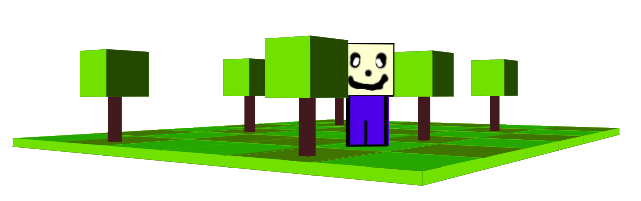

# Studying Css 3D

## In this project, I learn more about 3d using css and html. 

#### Atention: 
###### To turn more interesting I use javascript to manipulate the Dom and turn more easy to see any side



#### Archives architecture:

```
1- Css
    1- map.css
    2- player.css
    3- tree.css
    4- world.css
2- Javascript
    1- movePlayer.js
    2- rotate.js
3- Images
    1- face.png
    2- pants-front.png
    3- pants.side.png
4- index.html
```
#### rotate.js explanation
```js
// create variables
var direction = "";
let move = false;
var oldx = 0;
var oldy = 0;

    //select element used like a 3d objtect to world
const obj = document.getElementById("world");

// create a function to make the rotate object world
const mousemovemap = (e) => {
    const rotateX = (parseInt(obj.getAttribute("rotatex")))+e.pageX/100;
    const rotateY = (parseInt(obj.getAttribute("rotatey")))+e.pageY/100;
    if(move){
        if (e.pageY == oldy) {
            obj.style.transform = "rotate3d(0,1,0,"+rotateX+"deg)";
        }
        else if (e.pageX == oldx) {
            obj.style.transform = "rotate3d(1,0,0,"+rotateY+"deg)";
        }
        oldx = e.pageX;
        oldy = e.pageY;
        obj.setAttribute("rotatex",rotateX);
        obj.setAttribute("rotatey",rotateY);
    }
        
}
// set to listen to the movement of the mouse in the middle mouse button is clicked.
document.addEventListener('auxclick',(e)=>{
    if(move){
        move = false;
    }else{
        document.addEventListener('mousemove', mousemovemap);
        move = true;
    }
})
```
#### movePlayer.js explanation
```js
// create variables
let movePlayer = false ;
var playerX = 0;
var playerY = 0;

    // variable use to get element use like player 3d object 
const player = document.getElementById("player");

// set rotate of the player object
const mousemoveplayer = (e) => {
    if(movePlayer){
        if (e.pageY == playerY) {
            const x = parseInt(player.getAttribute("x"));
            const y = parseInt(player.getAttribute("y"));
            const z = parseInt(player.getAttribute("z"));
            const rotate = (parseInt(player.getAttribute("rotate")))+e.pageX/100;
            if((parseInt(playerX/10)+rotate/100)>=360){
                rotate = 0;
            }
            player.style.transform = 
            "rotate3d(0,1,0,"+rotate+"deg) translate3d("+x+"px,26px,"+y+"px)";
            player.setAttribute("rotate",rotate);
        }
            playerX = e.pageX;
            playerY = e.pageY;
    }
        
}

// set to listen to the movement of the mouse in the left mouse button is clicked
document.addEventListener('click',(e)=>{
    if(movePlayer){
        movePlayer = false;
        console.log(false);
    }else{
        document.addEventListener('mousemove', mousemoveplayer);
        console.log(true);
        movePlayer = true;
    }
})

const velocity = 10;

// verify the key pressed value
document.addEventListener("keydown", function (e) {
    switch(e.key){
        case "a":
        case "ArrowLeft":
            moveToLeft();
            break;
        case "w":
        case "ArrowUp":
            moveToUp();
            break;
        case "d":
        case "ArrowRight":
            moveToRight();
            break;
        case "s":
        case "ArrowDown":
            moveToDown();
            break;
        default:
            console.log("Comand Not Found");
    }
});

// set the movement of the player
function setPos(posValue){
    const playerPos = [
        player.style.left,
        player.style.top
    ];
    const x = parseInt(player.getAttribute("x"))+parseInt(posValue[0]);
    const y = parseInt(player.getAttribute("y"))+parseInt(posValue[1]);
    const z = parseInt(player.getAttribute("z"))+parseInt(posValue[2]);
    const rotate = parseInt(player.getAttribute("rotate"))
    player.style.transform="rotate3d(0,1,0,"+rotate+"deg) translate3d("+x+"px,26px,"+y+"px)";
       
    player.setAttribute("x",x);
    player.setAttribute("y",y);
    player.setAttribute("z",z);
}

// functions defined by move actions
function moveToRight(){
    setPos([velocity,0,0]);
}
function moveToLeft(){
    setPos([-velocity,0,0]);
}
function moveToUp(){
    setPos([0,-velocity,0]);
}
function moveToDown(){
    setPos([0,velocity,0]);
}
```
#### Css 3D Properties used explanation
```css
    /* 
        used to set the vision of the element as 3d object 
    */
    {
        transform-style: preserve-3d;
    }
    /* 
        used to set the position of the 3d element => translate3d(x,y,z)
    */
    {
        transform: translate3d(200px,0px,0px);
    }
    /*
        used to rotate the 3d element
    */
    {
        transform:rotateX(90deg);
    }
    /*
        Used to move and rotate or leave the rotation position 
        (note: if the object is rotated you have to set it again. 
        If you try to move the object and you don't, 
        the object moves but the rotation back to "0deg")
    */
    {
        transform:rotateX(90deg) translate3d(0px,0px,150px);
    }
    /*
    */
```

# :smile:
